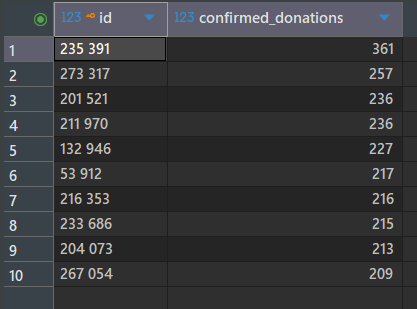
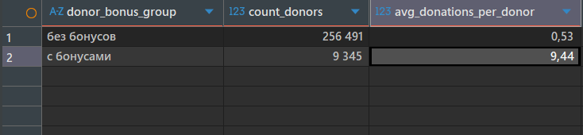
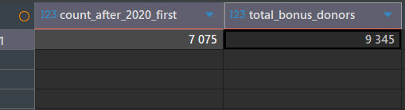
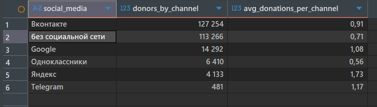
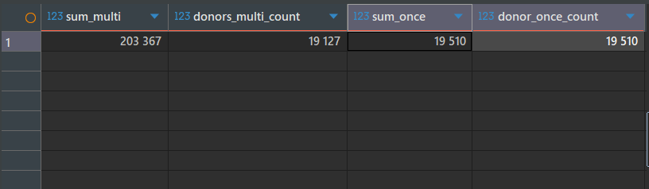
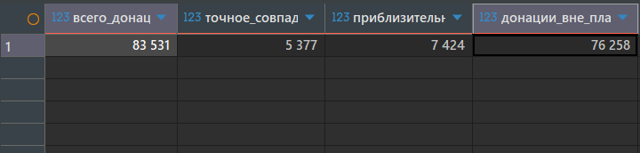

# blood_donor_analysis
Анализ базы доноров с помощью SQL
### ЗАДАНИЕ 1. Определить регионы с наибольшим количеством зарегистрированных доноров.
Получили топ-10 регионов по количеству зарегистрированных доноров.
[Код запроса](01_queries/sql01)

В лидерах по количеству зарегистрированных доноров, ожидаемо, крупные города с большим количеством жителей. Также существует множество данных о донорах без конкретной локации, что говорит о качестве данных.
### ЗАДАНИЕ 2. Изучить динамику общего количества донаций в месяц за 2022 и 2023 годы.
Получены данные за каждый месяц 2022 и 2023 года, за исключением декабря 2023 года, поскольку самые поздние донации в базе данных датируются ноябрем 2023 года. Дополнительно это проверилось через сортировку дат от большего к меньшему (существует несколько аномальных значений, например 3019 и 2055 год).
[Код запроса](01_queries/sql02)

Пик по количеству донаций наблюдается в холодное время года - осень и зима, а также начало года. Теплое время года отмечено снижением количества донаций. Также меньше донаций зарегистрировано в ноябре 2023 года (поскольку данные предоставлены за неполный календарный месяц).
### ЗАДАНИЕ 3. Определить наиболее активных доноров в системе, учитывая только данные о зарегистрированных и подтвержденных донациях.
Выведены топ-10 самых активных доноров по количеству подтвержденных донаций.
[Код запроса](01_queries/sql03)

Существуют доноры имеющее более 200 и 300 подтвержденных донаций. С большим отрывом самым активным донором стал донор с id 235391. 
### ЗАДАНИЕ 4. Оценить, как система бонусов влияет на зарегистрированные в системе донации. 
Доноры были разделены на две группы - с бонусами и без бонусов. На каждую группу посчитано число зарегистрированных доноров и среднее количество донаций на одного донора (уникального) из такой группы.
[Код запроса](01_queries/sql04)

В результате мы видим, что доноров, которые пользуются бонусами намного меньше, чем доноров, которые не пользуются бонусами (3,6 % против 96,4 %). Однако среди тех доноров, которые пользуются бонусами больше среднее количество донаций на донора. Это может говорить как о положительном влиянии системы бонусов на частоту донаций у каждого отдельного донора, так и о большей активности определенной группы доноров - больше донаций, соответственно больше бонусов. Здесь можно говорить о наличии корреляции, однако для подтверждения каузации необходимо провести дополнительные исследования, например: выяснить как изменилась частота донаций доноров до получения первого бонуса и после. 
### 4a. Оценка изменения активности доноров, получивших бонусы после введения бонусной системы. 
За основу взята выгрузка данных о датах получения бонусов. Самая ранняя дата получения донором бонуса - 29.12.2020. Теперь необходимо сравнить среднее количество донаций на донора, получившего бонусы до введения бонусной программы (до 2020 года) и после введения бонусной программы. 
[Код запроса](01_queries/sql04a)

Мы видим, что среди доноров, имеющих хотя бы один бонус, среднее количество донаций на такого донора за период ДО введения бонусной системы было больше, чем после ее введения. Это может говорить нам о том, что доноры, которые имеют бонусы - итак делали большое количество донаций, даже до получения бонусов. Однако стоит сделать поправку на то что период ДО введения бонусной системы несоизмеримо больше, чем после нее (данные после введения бонусной системы ограничиваются 3 годами). Поэтому также интересно посмотреть, в каком соотношении доноры с бонусами совершили донацию впервые уже после введения бонусной системы (в 2020 году или позднее).
[Код запроса](01_queries/sql04b)

Мы видим, что из 9345 доноров, имеющих бонусы, 7075 (75.5%) совершили первую донацию после введения бонусной системы в 2020 году. Это серьезный показатель, который говорит о том, что система бонусов действительно привлекает доноров к донациям и ее необходимо развивать. 
### 5. Исследовать вовлечение новых доноров через социальные сети. Узнать, сколько по каким каналам пришло доноров, и среднее количество донаций по каждому каналу.
Данные о количестве доноров и среднем количестве донаций сгруппированы вокруг социальных сетей, в которых авторизованы доноры.
[Код запроса](01_queries/sql05)

Наибольшее количество доноров авторизовано через социальную сеть Вконтакте, либо не авторизованы нигде. Наименьшее количество доноров авторизовано в Telegram. Однако активность доноров также различается в зависимости от социальной сети - пользователи Telegram, Google и Яндекс показывают наиболее высокое количество среднего числа донаций. Тогда как пользователи социальной сети Одноклассники и доноры, не указавшие социальную сеть отличаются наименьшей активностью. 
### 6. Сравнить активность однократных доноров со средней активностью повторных доноров
Оценили сколько суммарно было подтвержденных донаций среди доноров, которые сдали кровь однократно и тех, кто сдавал ее больше одного раза. Также, посмотрели, сколько всего имеется повторных доноров, в сравнении с единоразовыми.
[Код запроса](01_queries/sql06)

Соотношение повторных доноров и доноров, которые сдали кровь только 1 раз - приблизительно 50/50. При этом 50% доноров посредством повторной и последующих донаций обеспечивают 91,2 % от общего числа донаций.  
### 7. Сравнить данные о планируемых донациях с фактическими данными, чтобы оценить эффективность планирования.
Было сопоставлено количество уникальных донаций одного донора в одну дату, количество точных совпадений по дате плана и фактической сдачи, количество донаций, которые попадают во временной интервал 7 дней до и 7 дней после даты запланированной донации и количество донаций, сделанных вне плана. Также был применен фильтр по дате: считались фактические донации только после 20.11.2020 - первой даты в плане донаций. 
[Код запроса](01_queries/sql07)

В результате оказалось, что больше 90 % донаций, сделанных после введения плана сделаны сами по себе, незапланированно. Менее 10 % донаций попадают во временной интервал 7 дней до или после запланированной даты (такой диапазон выбран, как максимально приближенный к жизни, чтобы считать расхождение факта от плана в несколько дней - состоявшейся по плану донацией). Однако порядка 70% от таких случаев в диапазоне - совершены день-в-день. Это говорит нам о том, что подавляющее большинство донаций совершаются вне плана, однако из среди запланированных донаций также подавляющее большинство - происходят ровно по графику, доля отклонений на несколько дней - меньше 30%
