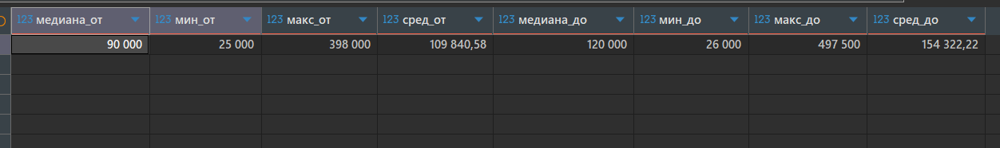
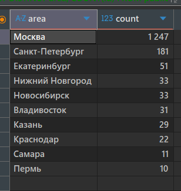
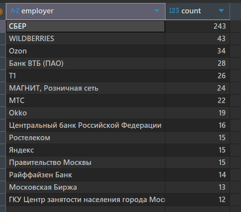
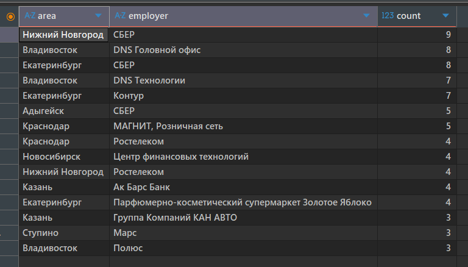
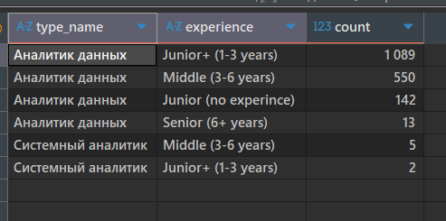
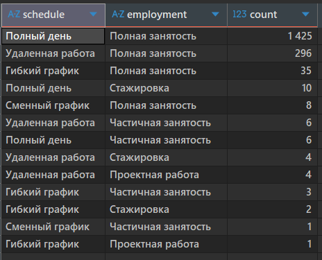
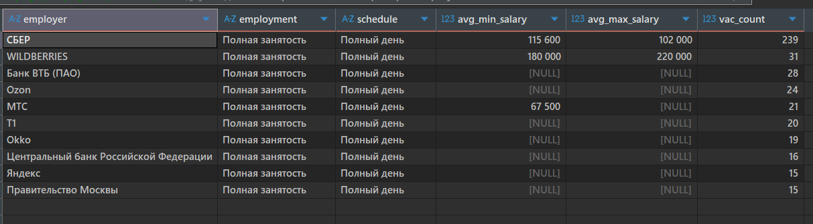
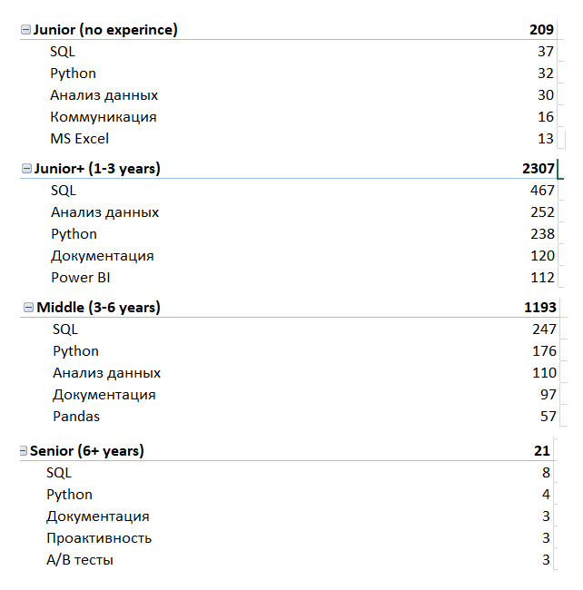
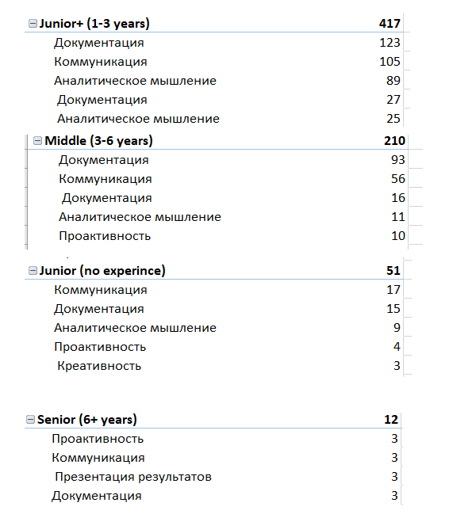

# Аналитика рынка вакансий на платформе HH.ru
Данные предоставлены в рамках образовательного курса «Аналитик данных» Яндекс Практикума. Исходный набор данных предоставлен с ресурса [hh.ru](https://hh.ru/) и использовался в учебных целях. Данные предоставлены за май и июнь 2024 г.
### Цель исследования 
Исследовать структуру спроса на аналитиков данных и системных аналитиков на рынке труда, определить основные требования работодателей, уровень предлагаемых зарплат, географию вакансий, форматы занятости и различия требований в зависимости от опыта
### Диапазон зарплат 
[Код запроса](02_queries/02_01sql).

.

В исходных данных обнаружено единичное значение 50 рублей в качестве нижней границы зарплаты. Поскольку это значение существенно отличается от остальных наблюдений и, вероятно, является ошибочным, оно было исключено из анализа. Таким образом минимальное значение зарплатной вилки составило 25 тыс. рублей, максимальное - 497,5 тыс. рублей. 
Среднее значение нижней границы составляет около 109 840 рублей, а среднее значение верхней границы — около 153 846 рублей. Таким образом, средние значения границ зарплатных вилок находятся примерно в диапазоне 110–154 тыс. рублей.
Медианное значение нижней границы зарплаты составило 90 тыс. рублей, верхней - 120 тыс. рублей.
### Количество вакансий и работодателей по регионам
Выявлены регионы с наибольшим количеством вакансий:
[Код запроса](02_queries/02_02sql)

Также выявлены основные компании-работодатели с наибольшим числом вакансий:
[Код запроса](02_queries/02_03sql)

Заметно, что Москва и Санкт-Петербург немного искажают общую картину "перетягивая" большую долю вакансий на себя, поэтому для большей информативности выявили топ-компаний работодателей в топ-регионах по количеству вакансий, кроме столиц.
[Код запроса](02_queries/02_04sql)

### Структура спроса
В базе представлены две категории аналитиков - Аналитики Данных и Системные аналитики, а также 4 типа грейдов - Junior (no experince), Junior+ (1-3 years), Middle (3-6 years), Senior (6+ years)
[Код запроса](02_queries/02_05sql)

-Так, можно увидеть, что наиболее востребованный грейд для аналитиков  - Junior+ (1-3 years) для Аналитиков данных, наименее востребованный (реже всего встречается в вакансиях) - Junior+ (1-3 years) для Системных аналитиков
Предлагаемые типы занятости

[Код запроса](02_queries/02_06sql)

Условия труда у популярных работодателей

[Код запроса](02_queries/02_07sql)

- Мы составили пары наиболее популярных сочетаний типов занятости и графиков работы для каждого популярного работодателя и увидели среднюю минимальную и максимальную зарплату для каждого из них. Отсутствие значения средней максимальной или минимальной зарплаты говорит о том, что работодатель ее не указывает. 
### Требования работодателей
По хард-скиллам

[Код запроса](02_queries/02_08sql)

-Для каждого ключевого навыка мы оценили, как часто он встречается для каждого конкретного грейда (вне зависимости от того, какой у него приоритет в тексте вакансии). Мы нашли наиболее востребованные навыки для каждого грейда в каждой категории навыков (key_skills_1, key_skills_2, key_skills_3, key_skills_4) Через сводную таблицу эти навыки собраны воедино, вне зависимости от того в каком столбце находился навык и отсортированы по убыванию от самых востребованных до менее востребованных: 

По софт-скиллам

[Код запроса](02_queries/02_09sql)

Так, мы видим, что наиболее востребованными навыками для аналитиков любых грейдов являются навыки владения SQL и Python, навыки работы с Документацией, и навыки анализа данных.
Среди дополнительных навыков самые востребованные – аналитическое мышление, умение работать с документацией, коммуникативные навыки и проактивность.

