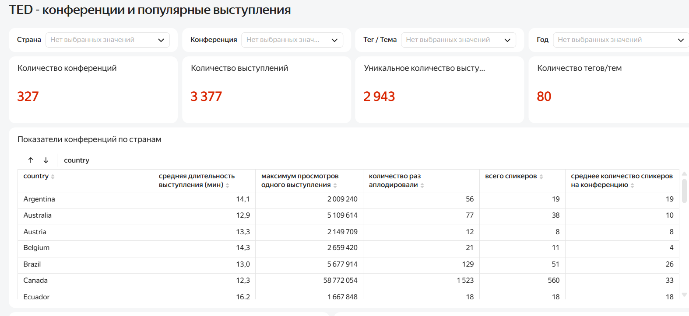
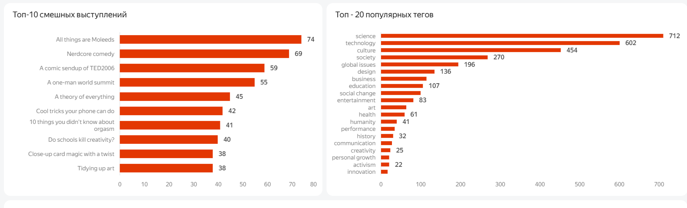
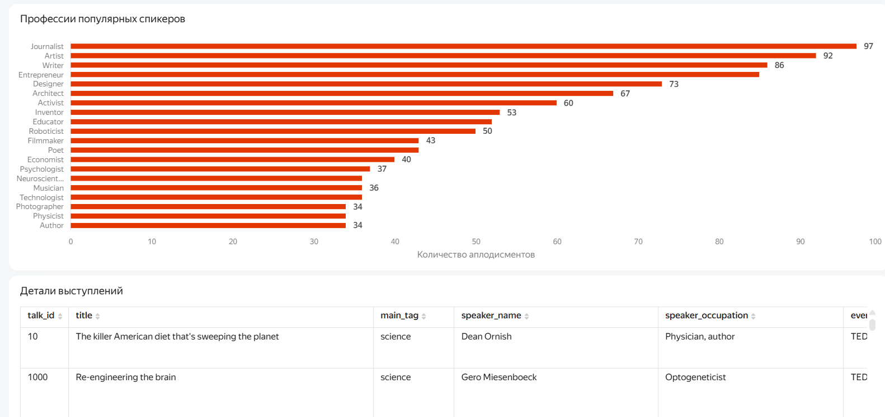

# Анализ TED-конференций

## О проекте
Данные предоставлены в рамках образовательного курса «Аналитик данных» Яндекс Практикума.
Компания приобрела лицензию на проведение конференций TED и готовит первое мероприятие. Для подготовки конференции необходимо изучить опыт уже проведённых TED-конференций: особенности мероприятий, выступлений, тем и зрительских реакций.

В рамках проекта разработан интерактивный дашборд в Yandex DataLens, позволяющий исследовать характеристики проведённых конференций и отдельных выступлений.

## Цель проекта

Исследовать опыт проведения TED-конференций и особенности выступлений, чтобы выявить характеристики мероприятий, тематики и зрительские реакции, которые могут быть полезны при подготовке нового мероприятия.

## Что анализировалось

В дашборде представлены следующие направления анализа:

- количество проведённых конференций и выступлений;
- характеристики конференций в разрезе стран;
- продолжительность выступлений и количество спикеров;
- зрительские реакции на выступления;
- наиболее популярные темы и теги;
- выступления с наибольшим количеством эпизодов смеха;
- профессии спикеров, получивших наибольшее количество зрительских аплодисментов;
- детализация отдельных выступлений.

Для исследования предусмотрены фильтры по году, стране, конференции, тегу и теме.
## Дашборд

Дашборд состоит из одной основной страницы и позволяет исследовать данные о TED-конференциях с помощью фильтров по году, стране, конференции, тегу и теме.

[Открыть интерактивный дашборд в Yandex DataLens](https://datalens.ru/03miyrvn07fmj-ted-konferencii-i-populyarnye-vystupleniya)

### Основные показатели и сравнение конференций

На верхней части дашборда представлены общие показатели количества конференций, выступлений и тематик, а также таблица с характеристиками конференций в разрезе стран.

### Популярность тем и выступлений

Дашборд позволяет анализировать популярность тематик, выступления с наибольшим количеством эпизодов зрительского смеха и профессии спикеров с наибольшим количеством зрительских аплодисментов.

### Спикеры и детализация выступлений

Дашборд позволяет оценить спикеры каких профессий чаще и больше всего получали зрительские аплодисменты во время выступлений

Таблица с детализацией выступлений позволяет получить подробную информацию о каждом выступлении с описанием. Таблица связана с фильтрами в верхней части дашборда, таким образом пользователь может выбрать выступления по интересующему параметру (страна, тема, профессия выступающего).

### Интерактивный дашборд

## Общие выводы

- В представленном наборе данных насчитывается 327 конференций, 3 377 выступлений и 80 различных тегов/тем, что позволяет сравнивать конференции, выступления и тематические направления.

- Среди представленных тематик наиболее часто встречаются science, technology и culture. Наиболее распространённой темой является science - 712 выступлений, далее следуют technology - 602 и culture - 454.

- Наиболее высокое количество зрительского смеха получили выступления All things are Moleeds, Nerdcore comedy и A comic sendup of TED2006 - 74, 69 и 59 эпизодов смеха соответственно.

- Среди профессий спикеров, получивших наибольшее количество зрительских аплодисментов, лидируют журналисты, художники и писатели - 97, 92 и 86 эпизодов соответственно.

- Дашборд показывает заметные различия между странами по характеристикам конференций: средней продолжительности выступлений, максимальному числу просмотров, количеству спикеров и зрительским реакциям.

- Использование фильтров по году, стране, конференции и теме позволяет детализировать общие показатели и сравнивать отдельные мероприятия и выступления.
