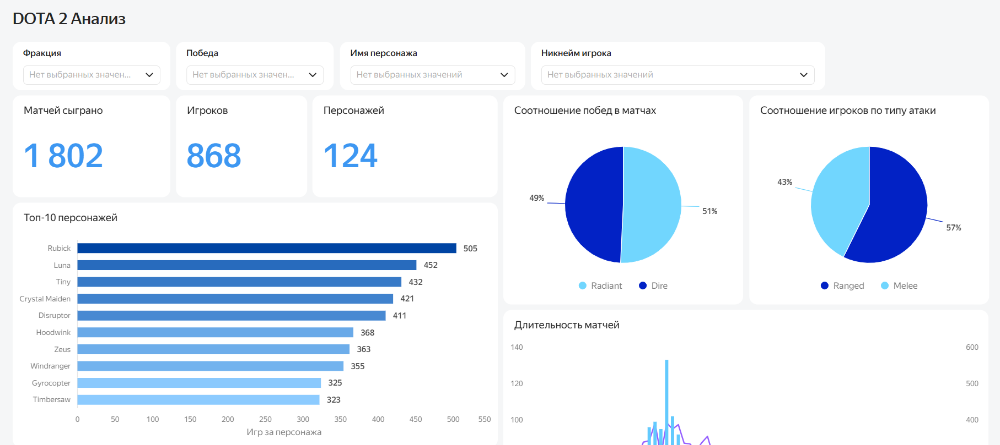
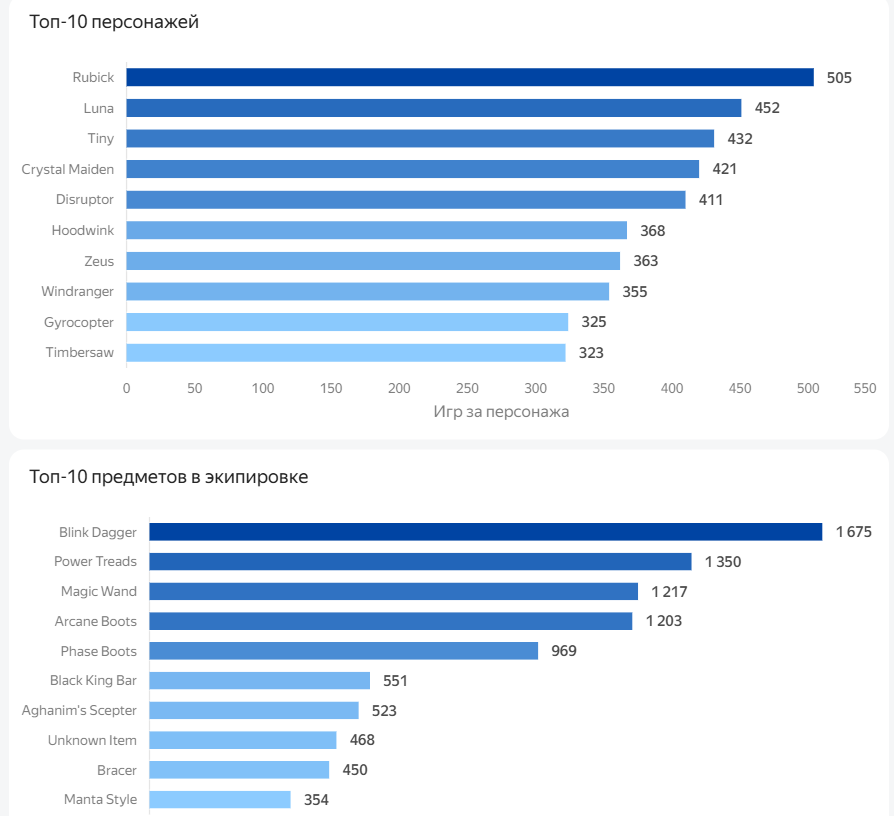
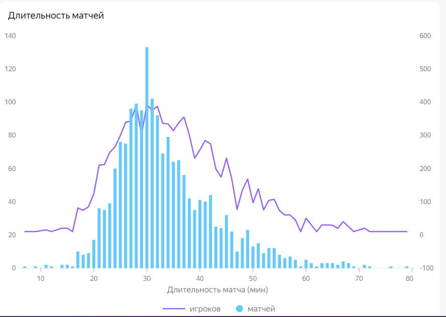
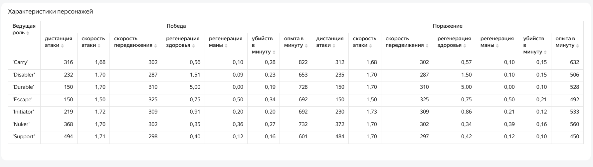

# Анализ матчей в игре DOTA2

## О проекте
Данные предоставлены в рамках образовательного курса «Аналитик данных» Яндекс Практикума, представляют собой базу данных отдела разработки игры DOTA2 с информацией о прошедших матчах, игроках и игровых персонажах. 

В рамках проекта разработан интерактивный дашборд в Yandex DataLens, позволяющий исследовать характеристики проведённых матчей и некоторых игровых характеристик персонажей.

## Цель проекта

Цель разработки дашборда - исследование основных показателей прошедших матчей для модернизации игровых функций персонажей, амуниции и хода матчей. Основной запрос команды разработки - визуализировать понимание особенностей боя персонажей, увидеть статистику по выбору игроками персонажей и их игровых навыков.

## Что анализировалось

В дашборде представлены следующие направления анализа:

- количественные показатели прошедших матчей
- соотношение выбора игроками типов атаки и фракции персонажа (существуют две основные фракции Radiant - светлые и Dire - темные)
- рейтинги наиболее популярных персонажей и игровых предметов
- детализированы характеристики персонажей в зависимости от ведущей роли в игре в разрез их побед и поражений
- собрана статистика по длительности матчей и количеству игроков которые участвую в матчах разной продолжительности

  Для удобства использования дашборда предусмотрены фильтры по фракции, итогу матча (победа/поражение), имени персонажа и никнейму игрока.

  ## Дашборд

Дашборд состоит из одной основной вкладки и позволяет исследовать данные о матчах с помощью фильтров. 

[Открыть интерактивный дашборд в Yandex DataLens](https://datalens.yandex/jo5pyc8jhcx82?_share_link=public)

## Основная статистика матчей

Верхняя часть дашборда демонстрирует основные количественные показатели матчей и соотношение выборов пользователей в пользу той или иной фракции и типа атаки. Также сверху находятся интерактивные фильтры для поиска интересующих деталей

## Наиболее популярные игровые персонажи и предметы

Графики демонстрируют топ-10 самых популярных (наиболее часто выбираемых персонажей) и топ-10 наиболее часто выбираемые предметы для экипировки.

## Длительность матчей

Комбинированная диаграмма показывает распределение матчей по времени их проведение, а также зависимость количества таких матчей и количества игроков, сыгравших в такие матчи от времени.

## Детализация основных характеристик персонажей

В таблице приведены главные характеристики игровых персонажей в зависимости от ведущей роли в матче. Данные представлены в разрезе побед и поражений персонажей (средние значения). Так, пользователи могут сравнить как отличаются характеристики героев в зависимости от того выиграл персонаж в данной роли матч или проиграл.

## Общие выводы 

- Всего сыграно 1802 матча, в которых приняло участие 868 уникальных игроков за 124 возможных игровых персонажа.
  
- Соотношение выбора фракции примерно одинаковое - в 51% случаев игроки выбирают играть за фракцию Radiant, в 49% случаев за Dire. Тип атаки в 57% случаев выбирают - Ranged (дальняя) и в 43% случаев - Melee (ближняя).
  
- Наиболее популярные персонажи - Rubick, Luna, Tiny, а наиболее популярные предметы - Blink Dagger, Power Treads, Magic Wand.
  
- Самая распространенная длительность матча - 30 минут. Таких матчей насчитывается больше всего и в них приняло участие больше всего игроков.
  
- Основные характеристики персонажей (скорость, восстановление, атака) не очень сильно отличаются для проигравших и победивших. Для победивших они в некоторых случаях выше, но по некоторым ролям - ниже. Можно предположить, что эти характеристики не являются главным условием победы и необходимо исследовать дополнительные факторы.

