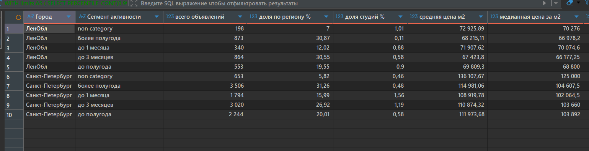
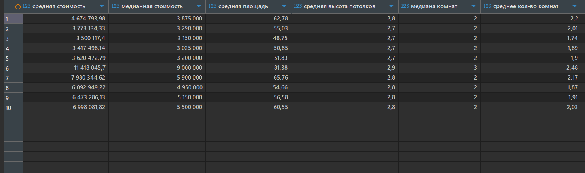
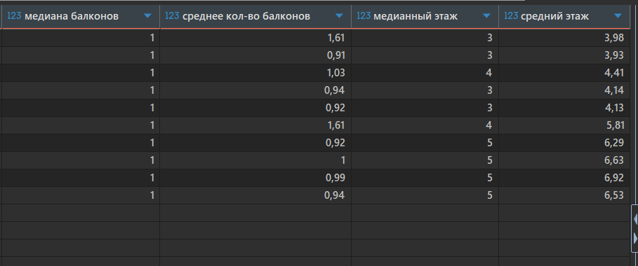
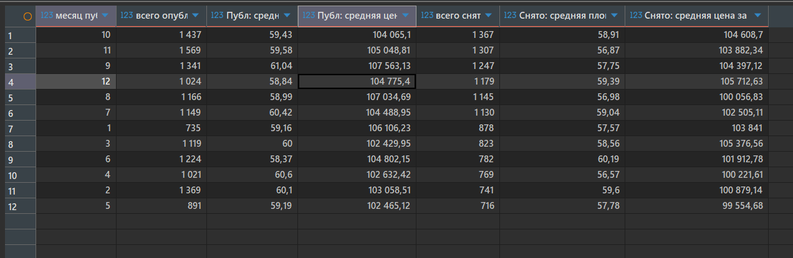
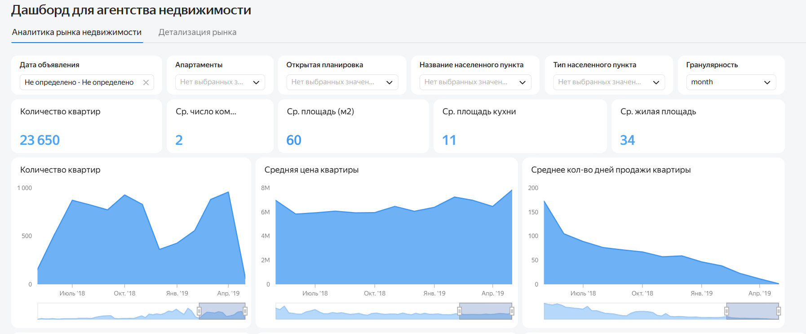
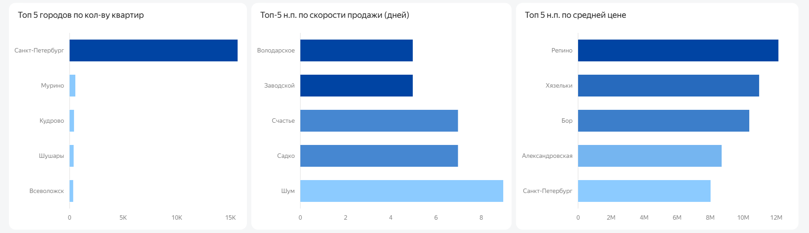
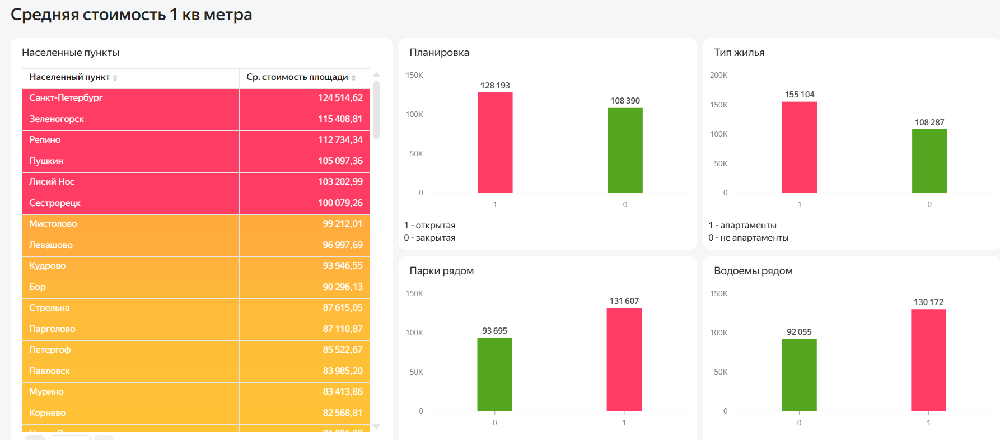
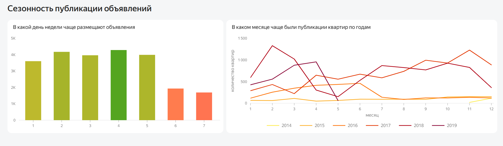

# Анализ рынка недвижимости Санкт-Петербурга и Ленинградской области (2015-2018)

## О проекте
Данные предоставлены в рамках образовательного курса «Аналитик данных» Яндекс Практикума. Исходный набор данных предоставлен сервисом [Яндекс. Недвижимость](https://realty.yandex.ru/)
С запросом обращается агентство недвижимости, которое планирует выходить на рынок Санкт-Петербурга и области. Заказчика интересуют наиболее перспективные сегменты недвижимости и сезонные тенденции на рынке в регионе. 

В рамках проекта написан SQL-запрос для выполнения двух ad-hoc задач (выявление наиболее востребованных сегментов недвижимость и выявление сезонных колебаний на рынке недвижимости)

## Цель проекта

Исследовать структуру рынка недвижимости, выявить "портрет" и характеристики наиболее продаваемых объектов, выявить взаимосвязь сезонности и изменений спроса и предложения на квартиры.

## Что анализировалось

- скорость реализации квартиры оценивалась по количеству дней нахождения объявления на сайте, квартиры были ранжированы на несколько сегментов по скорости продажи: до 1 месяца, от 1 до 3 месяцев, от 3 месяцев до полугода и от полугода. 
-  характеристики наиболее продаваемых квартир (менее 1 месяца): статистические метрики площади, количества комнат и балконов, показатели цены: средняя стоимость и средняя стоимость квадратного метра
- сезонные колебание цены в разрезе 4-х лет, взаимосвязь сезонности с другими характеристиками недвижимости (площадь). Анализ в разрезе предложения (опубликованные объявления) и спроса (снятые с публикации/проданные)
- рейтинг населенных пунктов по скорости продажи квартиры, по средней цене недвижимости
- зависимость средней стоимости квадратного метра от города, планировки, типа жилья, наличия факторов благоустройства территории (парки, водоемы)

## Наиболее продаваемые квартиры

Квартиры разделены по регионам (СПБ И ЛО) на несколько сегментов по скорости их продажи (скорости снятия объявления с публикации). Параллельно для каждого сегмента выявлены средние и медианные значения по следующим показателям: площадь, количество комнат, количество балконов, этаж, стоимость квартиры и одного квадратного метра. 

[Код запроса](05_queries/real_estate_sql1)

## Сезонность объявлений

Данные по количеству объявлений (опубликованных и снятых) отражают структуру спроса и предложения и того в какие месяцы активнее выставляются и продаются квартиры. Также в разрезе месяцев за 4 года выявлена средняя площадь квартир и средняя стоимость квадратного метра в стремлении оценить как эти показатели меняются от сезона к сезону. Данные по публикациям объявлений отражают активность продавцов, а по снятиями - активность покупателей.

[Код запроса](05_queries/real_estate_sql2)

## Дашборд

Дашборд состоит из двух вкладок. Наверху первой страницы представлена общая статистическая информация о квартирах, продаваемых в двух регионах. Также, можно посмотреть более детальную информацию по интересующим сегментам недвижимости. Это позволяют сделать фильтры по типу и названию населенного пункта, планировке и дате объявления. 

## Топ населенных пунктов

Также, представлены три рейтинга городов по следующим показателям: количество объявлений, скорость продажи, средняя цена

## Стоимость квадратного метра

Приведено наглядное сравнение факторов, которые влияют на среднюю стоимость квадратного метра. Населенные пункты разделены на категории по цене квадратного метра (для наглядности выделены цветом). Также оценивается влияние прочих факторов. Как можно видеть на графиках - влияние таких факторов как планировка, тип квартиры (апартаменты/нет), близость водоемов и парков - существенно влияет на цену.

## Сезонность публикаций

Графики демонстрируют в какие дни недели и месяцы чаще всего публикуются объявления. Результат показывает, что наиболее популярными днями являются будни со вторника по четверг, а серди сезонов лидирует осень (по всем годам график растет).

## Аналитические выводы

- Больше всего в Санкт-Петербурге и Ленинградской области квартир с долгим сроком продажи (от полугода), меньше всего с быстрой реализацией (до одного месяца).
- Среди быстро продающихся квартир Санкт-Петербурга самая низкая средняя цена, и за квартиру, и за квадратный метр. В Ленинградской области, наоборот, быстрее уходят квартиры с более высокой ценой. Возможно, ликвидность и стоимость зависят от размера города и близости к столице, но по имеющимся данным это только предположение.
- *Портрет быстро продающейся квартиры* в обоих регионах такой: компактная 1-2-комнатная квартира площадью около 48-54 м2 с балконом, на среднем или высоком этаже (от 4-5-го в Санкт-Петербурге и от 3-4-го в Ленинградской области). Разница по этажам, вероятно, объясняется этажностью застройки.
- Активность на рынке выше в холодное время года, примерно с сентября по март: в эти месяцы больше и публикаций, и снятий. Весна, лето и январь это период спада по публикациям и продажам, возможно, из-за отпусков и праздников.
- Устойчивой связи между параметрами квартир (цена за м2, площадь) и сезоном нет, кроме одного исключения: для проданных (снятых с публикации) квартир средняя цена за квадратный метр выше в холодное время года (осень-зима).
- Помимо базовых характеристик квартиры на среднюю стоимость одного квадратного метра существенно влияют такие факторы как: юридический статус (апартаменты), маневр для организации жилого пространства (открытая планировка), близость рекреационных объектов - парков и водоемов.

  ## Рекомендации заказчику

- Для быстрого выхода на рынок и быстрого заключения первых сделок рекомендуется начинать работу в сентябре-октябре и вести интенсивную маркетинговую кампанию вплоть до марта.
- В первую очередь делать ставку на небольшие 1-2-х комнатные квартиры в обоих регионах (В СПБ это также могут быть студии) с ценой ниже средней для Санкт-Петербурга и слегка выше средней для Ленинградской области.
- Ориентироваться на долгий срок продажи и не привязывать цену к месяцу. Почти треть квартир на рынке продаются более полугода. 
